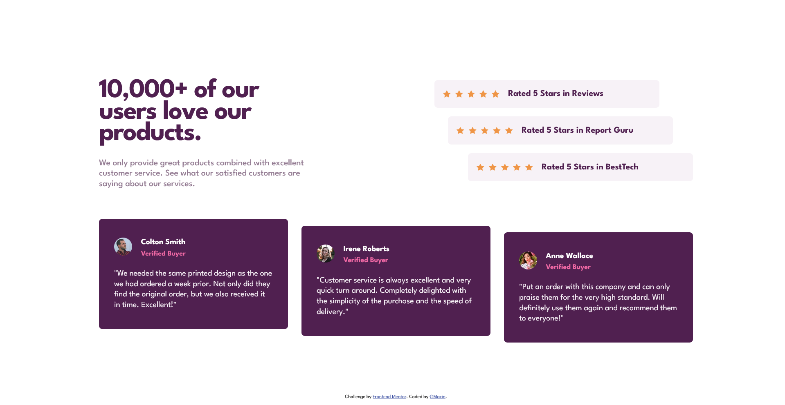

# Frontend Mentor - Social proof section solution

This is a solution to the [Social proof section challenge on Frontend Mentor](https://www.frontendmentor.io/challenges/social-proof-section-6e0qTv_bA). Frontend Mentor challenges help you improve your coding skills by building realistic projects.

## Table of contents

- [Overview](#overview)
  - [The challenge](#the-challenge)
  - [Screenshot](#screenshot)
  - [Links](#links)
- [My process](#my-process)
  - [Built with](#built-with)
  - [What I learned](#what-i-learned)
  - [Continued development](#continued-development)
  - [Useful resources](#useful-resources)
- [Author](#author)

## Overview

### The challenge

Users should be able to:

- View the optimal layout for the section depending on their device's screen size
- See hover reaction over the interactive elements.

### Screenshot



### Links

- Solution URL: [Frontend Mentor](https://www.frontendmentor.io/solutions/solution-using-css-grid-flexbox-and-media-queries-html-and-css-jFzsxXxgqo)
- Live Site URL: [Netlify](https://social-proof-section-macin.netlify.app/)

## My process

### Built with

- Semantic HTML5 markup
- CSS custom properties
- Flexbox
- CSS Grid
- Mobile-first workflow
- Media Queries
- [League Spartan](https://fonts.google.com/specimen/League+Spartan) - Google Fonts

### What I learned

I learned how to reposition elements within it's two-dimensional vector [tx, ty].
The next CSS rulset helped me out to solve some of the issues related to this challenge.

```css
.two-testimonial {
  transform: translateY(1rem);
}
```

### Continued development

I want to continue on learning everything related to responsive design, like orientations (landscape, portrait) media features for building complex layouts.

### Useful resources

- [MDN Web Docs](https://developer.mozilla.org/en-US/docs/Web/CSS/transform-function/translate) - This CSS property helped me for reduce the time to position some HTML elements.

## Author

- Frontend Mentor - [@MacinME](https://www.frontendmentor.io/profile/MacinME)
- Twitter - [@ErnestGadget](https://www.twitter.com/ErnestGadget)
- GitHub - [@MacinME](https://github.com/MacinME)
